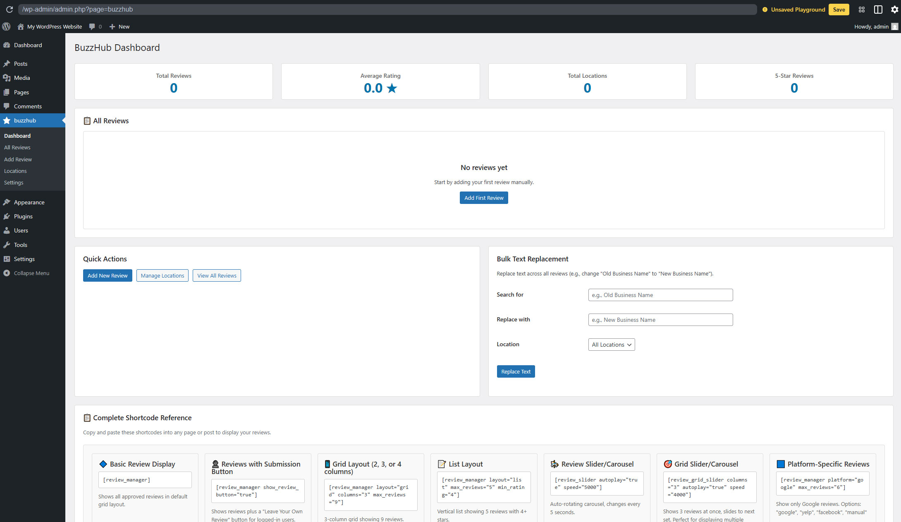
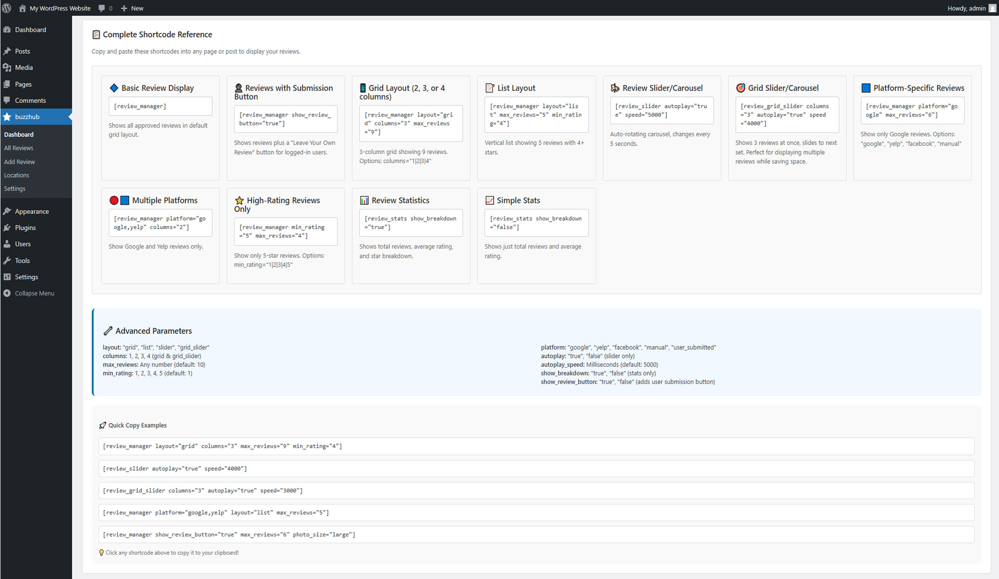
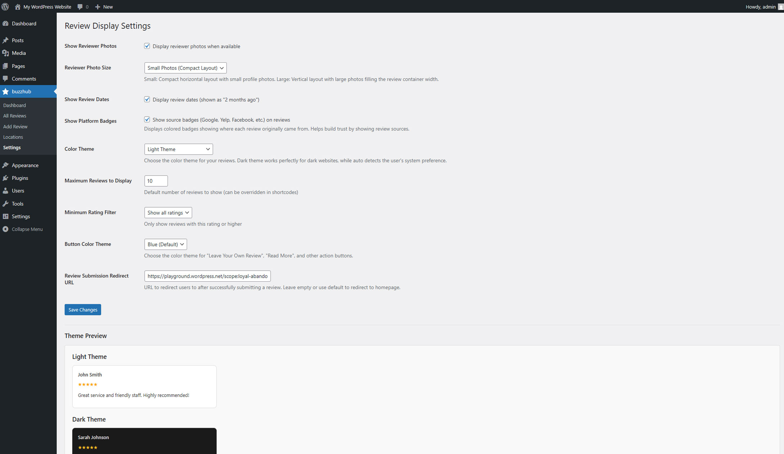

<div align="center">


# BuzzHub

**A WordPress plugin for manually curating and displaying customer reviews from multiple business locations — with full editorial control and no dependency on external review APIs.**

[](LICENSE)
[](README.txt)
[](https://wordpress.org)
[](https://www.php.net)

[Surefire Studios](https://surefirestudios.io/) · [Report an issue](https://github.com/SurefireStudios/BuzzHub/issues)

</div>

---

Reviews are stored in your own database, so you decide what is published, how it reads, and how it looks. Includes Google, Yelp and Facebook platform badges for attribution.

Unlike review plugins that pull from external APIs, nothing here depends on a third-party service: no API keys, no rate limits, no quota, and no outage that takes your testimonials offline.

<div align="center">
  
  <br><em>The BuzzHub dashboard — review stats, quick actions, bulk text replacement and a full shortcode reference.</em>
</div>

## Contents

- [Features](#features)
- [Screenshots](#screenshots)
- [Requirements](#requirements)
- [Installation](#installation)
- [Quick start](#quick-start)
- [Shortcodes](#shortcodes)
- [User review submissions](#user-review-submissions)
- [Settings](#settings)
- [Search engine markup](#search-engine-markup)
- [Project structure](#project-structure)
- [FAQ](#faq)
- [Contributing](#contributing)
- [License](#license)

## Features

- **Manual review management** — add, edit and delete reviews from the WordPress admin, with no third-party API keys or rate limits.
- **Multiple locations** — group reviews by business location and filter any display by location.
- **User submissions** — let logged-in visitors submit reviews through a front-end form, with optional photo upload, held for approval before publishing.
- **Moderation workflow** — approve, feature or hide individual reviews, with an email notification to the admin on each new submission.
- **Four display layouts** — grid, list, slider and grid-slider, plus a standalone statistics block.
- **Platform badges** — Google, Yelp and Facebook icons showing where each review came from.
- **Bulk text replacement** — search and replace across review text, scoped to a location if needed. Useful when a business rebrands.
- **Structured data** — JSON-LD markup so search engines can read your reviews.
- **Theming** — light, dark or automatic, seven button colours, and two reviewer photo sizes.
- **Built-in shortcode reference** — every shortcode, parameter and a set of copy-paste examples live in the dashboard.

## Screenshots

| | |
| --- | --- |
|  | **Dashboard** — total reviews, average rating, locations and 5-star count, with quick actions and bulk text replacement. |
|  | **Shortcode reference** — every layout and parameter with click-to-copy examples, built into the admin. |
|  | **Display settings** — photos, dates, platform badges, colour theme and button colour, with a live light/dark preview. |

## Requirements

| | |
| --- | --- |
| **WordPress** | 5.8 or later (tested up to 6.8) |
| **PHP** | 7.4 or later |
| **Plugin version** | 1.2.4 |
| **License** | [GPL-2.0-or-later](LICENSE) |

## Installation

### From this repository

```bash
cd wp-content/plugins
git clone https://github.com/SurefireStudios/BuzzHub.git
```

Then activate **BuzzHub** from **Plugins** in the WordPress admin.

### From a zip

1. Upload the plugin files to `/wp-content/plugins/buzzhub/`.
2. Activate **BuzzHub** through the **Plugins** menu in WordPress.

Database tables are created automatically on activation.

## Quick start

1. Go to **BuzzHub → Locations** and add your business locations.
2. Go to **BuzzHub → Add Review** to add reviews manually, or enable user submissions.
3. Drop a shortcode onto any page or post to display them.
4. Adjust appearance under **BuzzHub → Settings**.

The dashboard carries a complete shortcode reference with copy-paste examples, so you rarely need to leave the admin to build one.

## Shortcodes

### `[review_manager]`

The main display shortcode.

```
[review_manager layout="grid" columns="3" max_reviews="9" min_rating="4"]
```

| Attribute | Default | Description |
| --- | --- | --- |
| `layout` | `grid` | `grid`, `list`, `slider` or `grid_slider`. |
| `columns` | `3` | `1`–`4`. Applies to grid and grid-slider layouts. |
| `max_reviews` | `10` | Maximum reviews to display. |
| `min_rating` | `1` | `1`–`5`. Hide reviews rated below this value. |
| `platform` | `all` | `google`, `yelp`, `facebook`, `manual` or `user_submitted`. Accepts a comma-separated list. |
| `location_id` | `0` | Restrict to one location. `0` shows all. |
| `sort_by` | `review_date` | Field to sort on. |
| `order` | `DESC` | `ASC` or `DESC`. |
| `show_photos` | `true` | Show reviewer photos. |
| `show_dates` | `true` | Show review dates. |
| `show_platform` | `true` | Show the platform badge. |
| `truncate` | `50` | Word count before truncating review text. |
| `theme` | — | Optional theme variant. |
| `photo_size` | — | `small` or `large`. |
| `show_review_button` | `false` | Show a submission button to logged-in users. |

### `[review_slider]`

A carousel of reviews.

```
[review_slider autoplay="true" speed="4000"]
```

Accepts the filtering and display attributes above, plus:

| Attribute | Default | Description |
| --- | --- | --- |
| `autoplay` | `true` | Advance slides automatically. |
| `speed` | `5000` | Milliseconds between slides. |
| `arrows` | `true` | Show previous / next arrows. |
| `dots` | `true` | Show pagination dots. |

Note that `max_reviews` defaults to `20` here rather than `10`.

### `[review_grid_slider]`

A grid that pages through reviews, combining the grid and slider behaviours.

```
[review_grid_slider columns="3" autoplay="true" speed="3000"]
```

### `[review_stats]`

Aggregate rating statistics.

```
[review_stats show_breakdown="true"]
```

| Attribute | Default | Description |
| --- | --- | --- |
| `location_id` | `0` | Restrict to one location. `0` covers all. |
| `show_total` | `true` | Show the total review count. |
| `show_average` | `true` | Show the average rating. |
| `show_breakdown` | `false` | Show the per-star distribution. |
| `theme` | — | Optional theme variant. |

## User review submissions

Add `show_review_button="true"` to any display shortcode to show a **Leave Your Own Review** button:

```
[review_manager show_review_button="true" max_reviews="6" photo_size="large"]
```

The flow:

1. A visitor clicks the button.
2. They log in — required, as a spam control.
3. They complete the review form, optionally uploading a photo.
4. The review is stored unapproved and the site admin is emailed.
5. You approve, edit or reject it from the admin.
6. Approved reviews appear on the site.

You keep full editorial control over submitted reviews, including text, rating and reviewer details.

## Settings

Configured under **BuzzHub → Settings** and stored in the `buzzhub_display_settings` option.

| Setting | Values | Description |
| --- | --- | --- |
| `color_theme` | `light`, `dark`, `auto` | Colour scheme for review output. `auto` follows the visitor's system preference. |
| `button_color` | `blue`, `black`, `red`, `green`, `purple`, `orange`, `grey` | Accent colour for buttons. |
| `photo_size` | `small`, `large` | Small is a compact horizontal layout; large is vertical with full-width photos. |
| `max_reviews` | number | Default maximum reviews per display. |
| `min_rating` | number | Default minimum rating to display. |
| `show_photos` | on / off | Show reviewer photos by default. |
| `show_dates` | on / off | Show review dates by default. |
| `show_platform` | on / off | Show platform badges by default. |
| `redirect_after_review` | URL | Where to send a user after they submit a review. Defaults to the site home. |

Shortcode attributes override these defaults per display.

## Search engine markup

Review output includes JSON-LD structured data — a `schema.org` `ItemList` of `Review` items, each carrying its author and rating. This is what lets search engines understand the reviews on the page.

## Project structure

```
review-manager.php        Plugin bootstrap, constants, activation hooks
includes/
  class-admin.php         Admin pages and AJAX handlers
  class-database.php      Schema and queries
  class-frontend.php      Front-end rendering and structured data
  class-shortcodes.php    Shortcode registration
  class-user-reviews.php  Front-end submission handling
templates/                Admin screen markup
assets/                   Admin and front-end CSS / JS
assets/src/img/           Banners, icons and screenshots
```

## FAQ

**Do I need API keys from Google or Yelp?**
No. Reviews are added manually from any source and stored in your own database.

**Can I edit user-submitted reviews?**
Yes — every field, including text, rating and reviewer information.

**Does it support multiple business locations?**
Yes. Create a location per site or branch, then filter any display with `location_id`.

**Are the reviews SEO friendly?**
Yes. See [Search engine markup](#search-engine-markup).

**Can I customise the appearance?**
Light, dark and automatic themes, seven button colours and two photo sizes are built in. Anything further can be done with custom CSS.

Full details, changelog and privacy notes are in [README.txt](README.txt).

## Contributing

Issues and pull requests are welcome. Please keep changes scoped and run `php -l` over any PHP you touch.

## License

Released under the GNU General Public License v2.0 or later. See [LICENSE](LICENSE) for the full text.

Built by [Surefire Studios](https://surefirestudios.io/).
